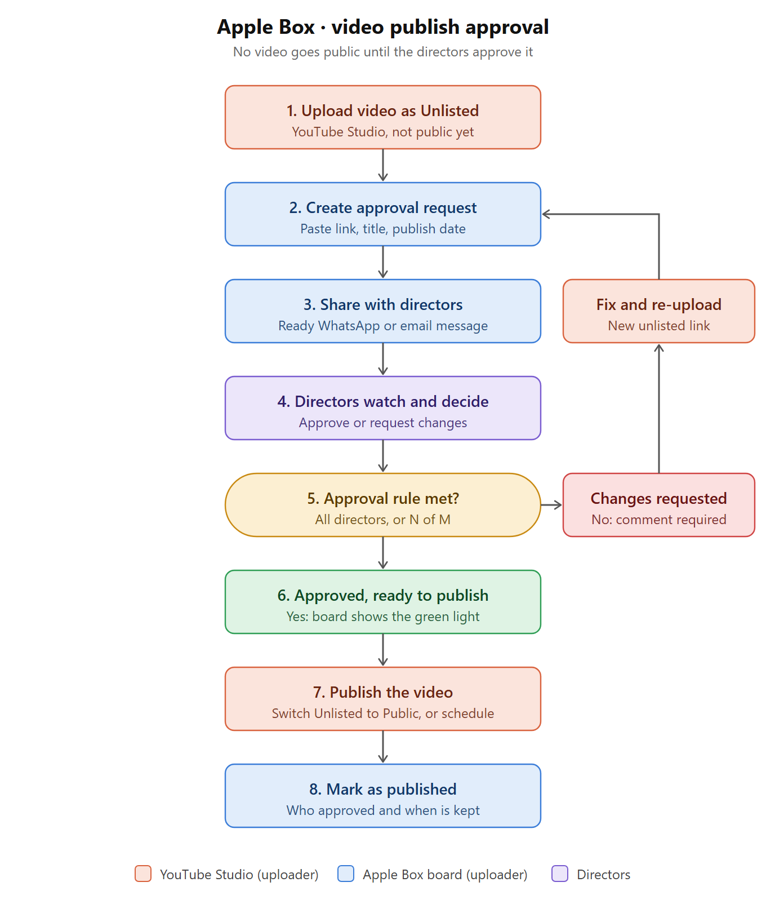

# Video publish approval — feasibility and requirements

## Goal
No video goes public on the Apple Box YouTube channel until the directors (the approval board)
have watched it and approved it. The board records who approved what, and when.

## The flow
1. Uploader uploads the video to YouTube with visibility **Unlisted** (not Public, not Scheduled).
2. Uploader creates an **approval request** in the board: YouTube link, title, description, target publish date, approvers.
3. Uploader shares the request with the approvers (WhatsApp / email message prepared by the board).
4. Each approver opens the request, watches the video inside the board, and chooses
   **Approve** or **Request changes** (with a comment).
5. When the approval rule is met the request becomes **Approved**.
6. Uploader publishes in YouTube Studio (Unlisted → Public), then marks the request **Published**.

## Feasibility

| Part | Feasible? | How / limits |
|---|---|---|
| Share a video before it is public | Yes | YouTube **Unlisted**: anyone with the link can watch, no Google account needed, and it can be embedded in the board. **Private** also works but each director must be invited by Google account in YouTube Studio and it cannot be embedded. **Scheduled** videos are private until they go live, so scheduling happens *after* approval. |
| Approval request, votes, comments, history in the board | Yes | Same stack as today (static page + Firebase). Same effort class as the Time/Invoices features. |
| Directors identify themselves | Yes | Google sign-in, the same way the team signs in now. Each decision is stored with the director's account. |
| Notify directors | Partly | The site has no server, so it cannot send email by itself. Phase 1: the board prepares the message and opens WhatsApp / email with link and text filled in. Automatic email needs a Firebase extension or Cloud Function on the paid (Blaze) plan — phase 2. |
| Technically **block** publishing until approved | No (with manual publishing) | YouTube has no approval feature. Anyone with channel access can press Publish in YouTube Studio. The board makes the rule visible and auditable; it cannot lock YouTube. Mitigation: only the uploader role has channel access, and the board shows a clear "NOT APPROVED — do not publish" state. |
| Board publishes the video itself after approval | Possible, phase 3 | YouTube Data API can switch Unlisted → Public. Needs a Google Cloud project, OAuth consent screen and the channel owner signing in to grant access. In "testing" mode the grant expires every 7 days; permanent use needs Google's app verification. Worth it only if manual publishing becomes a real problem. |
| Replace the video file after change requests | No (YouTube limit) | YouTube cannot swap the file of an existing video. A corrected video is a new upload with a new link → a new **version** of the request, and approvals start again. |

**Verdict:** phases 1 is fully doable now with no new services and no cost. The one thing software
cannot give you without the YouTube API is a hard lock on the Publish button.

## Roles
| Role | Can do |
|---|---|
| Uploader (team member) | Create / edit requests, add a new version, share, mark as published, cancel |
| Approver (director) | Watch, approve, request changes, comment. Cannot approve their own upload |
| Admin | Everything, plus: choose who is an approver, set the approval rule, override with a written reason |

## User stories
1. **Create request** — As an uploader, I paste the unlisted YouTube link, and add title, description,
   thumbnail note, target publish date/time and approvers, so that directors know exactly what will go live.
   - The link must be a valid YouTube URL; the board shows the embedded player as a check.
   - Optional link to a board story (e.g. AB-34).
2. **Pre-publish checklist** — As an uploader, I tick: title and description final, thumbnail uploaded,
   "made for kids" set correctly, music and actor rights confirmed (AB-29/AB-30), end screen added.
   A request cannot be sent for review with unticked required items.
3. **Share** — As an uploader, I press "Share with approvers" and get a ready message
   ("Please review *<title>* before <date>: <board link>") for WhatsApp, email or copy-paste.
4. **Review** — As a director, I open the link, sign in with Google, watch the video in the page and
   choose **Approve** or **Request changes**. A comment is required for change requests and may
   reference a time in the video (e.g. `02:15 logo is cut off`).
5. **Approval rule** — As an admin, I set the rule: *all approvers* (default) or *at least N of M*.
   The request shows progress ("2 of 3 approved") and who is still pending.
6. **Changes requested** — One change request puts the request into **Changes requested**. The
   uploader adds a new version (new YouTube link). All earlier approvals are cleared; history is kept.
7. **Publish** — When **Approved**, the uploader sees "Ready to publish", the target date and a button
   that opens the video in YouTube Studio. After publishing they press "Mark as published";
   the board stores the public link, time and person.
8. **Approval expires on edit** — If title, description or link change after approval, the request
   returns to **In review** (directors approved something specific).
9. **Dashboard** — Approvals tab: Waiting for me · In review · Changes requested · Approved (ready
   to publish) · Published. Overdue reviews (target date near, approvals missing) are highlighted.
10. **Audit trail** — Every action (created, shared, approved, changes requested, new version,
    override, published) is stored with person and time and cannot be edited.
11. **Emergency override** — As an admin, I can mark a request approved with a mandatory reason;
    it is shown permanently on the request.

## Status model
`Draft → In review → (Changes requested → In review …) → Approved → Published`, plus `Cancelled`.

## Data model (proposal)
```
config/team.approvers = [email, …]            approval.rule = { type:"all" | "count", count:N }
videos/{id} = { title, description, publishAt, storyId, status, createdBy, createdAt,
                approvers:[email],
                versions:[{ n, url, videoId, addedBy, addedAt, note }],
                decisions:{ "<version>|<emailKey>": { decision:"approved"|"changes", comment, at } },
                checklist:{…}, published:{ url, by, at }, override:{ by, at, reason } | null,
                history:[{ at, by, action, detail }] }
```
**Security:** a new `videos` collection needs a small addition to `firestore.rules` (pasted once in
the Firebase console) so that a decision can only be written by the approver it belongs to and
history cannot be rewritten. Without that change the feature still works, but — like the rest of
the board today — any signed-in team member could technically edit any record.

**Director access:** directors are added to the team list as *Approver*. They only see the
Approvals tab. (UI-level separation, same as Time/Invoices; strict separation needs the rules change above.)

## Out of scope for phase 1
Automatic email/push notifications, publishing through the YouTube API, reading YouTube
status automatically, approval of Facebook / Instagram / TikTok posts (same flow could be reused later).

## Phases
| Phase | Content | Needs |
|---|---|---|
| 1 | Approvals tab, requests, versions, votes, comments, rule, checklist, share message, audit trail, mark published | Nothing new (optional rules paste) |
| 2 | Automatic email to approvers and reminder before the target date | Firebase Blaze plan + email extension |
| 3 | "Publish now" from the board through the YouTube Data API; auto-detect that a video went public | Google Cloud project, OAuth consent, channel owner grant |

## Phase 1 — as built


Defaults chosen where no decision was given (all changeable):
- **Approvers** are team members marked *Approver* in *Team & access* (admin only). They sign in with Google.
  An approver who is not an admin sees **only the Approvals tab**.
- **Rule** is chosen per request: all chosen approvers (default) or at least N.
- **Notify** with a prepared message: WhatsApp, email (to the approvers still waiting) or copy. The message
  links to `…/#v=<request>` which opens the request straight after sign-in.
- **Storage** is `board/vid-<id>`, so no Firestore rules change was needed. Role separation is UI-level,
  like Time and Invoices. "Changes requested" / "Approved" are calculated from the decisions on the
  current version, never stored, so simultaneous decisions cannot overwrite each other.
- Editing title, description or link after sending creates a new version (approvals restart); a video
  the uploader is also an approver of cannot be approved by them; admins can override with a reason.
- The video keeps playing while other people's decisions arrive (only the side panel refreshes).

## Decisions needed before building
1. Who are the approvers, and is the rule *all of them* or *N of M*?
2. Do all directors have a Google account to sign in with? (If not: access-code page like the client checklist, but then approvals are not tied to a verified person.)
3. May directors see the rest of the internal board, or only Approvals?
4. How do you want to notify them in phase 1 — WhatsApp, email, or both?
5. Who has publishing rights on the YouTube channel today? (Fewer people = stronger gate.)
